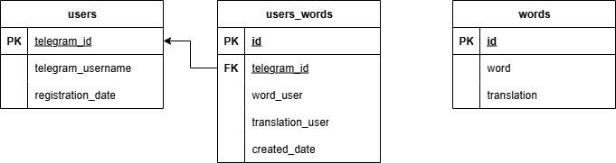

# EnglishCardBot

## Описание
Бот для обучения английскому языку. Основные возможности:
- Бот спрашивает перевод слова на русском и предлагает 4 варианта на английском языке в виде кнопок
- При правильном ответе подтверждает ответ, при неправильном - предлагать попробовать снова
- Добавление новых слов
- Удаление добавленных слов
- Переключение на следующую карточку с словом

## Технологии
- Python 3.10+
- PostgreSQL для хранения данных
- SQLAlchemy (ORM) для работы с базой данных
- Aiogram 3.x для работы с Telegram API и FSM
- Pytest для модульного и интеграционного тестирования
- python-dotenv для загрузки переменных окружения из .env файла
- Асинхронное программирование с asyncio (используется в Aiogram)

## Установка и настройка

### 1. Требования
- Зарегестрированный телеграмм бот в BotFather
- Доступ к серверу PostgreSQL

### 2. Настройка окружения
Создайте файл `.env` в корне проекта на основе `.env.example`:
```ini
# Database
DB_NAME=translator_db
DB_USER=postgres
DB_PASSWORD=your_password
DB_HOST=localhost
DB_PORT=5432

# Telegram bot token
BOT_TOKEN=your_bot_token_here
```
### 3. Установка зависимостей
```commandline
pip install -r requirements.txt
```

### 4. Инициализация базы данных
```commandline
python -m src.db.create_db
```

## Запуск бота
`python -m src.bot`

## Настройка тестирования

Конфигурация **pytest** находится в файле `pytest.ini`:
```
[pytest]
pythonpath = src
markers =
    asyncio: mark async tests
asyncio_default_fixture_loop_scope = session

```
## Тестирование

В проекте используются модульные (юнит) и интеграционные тесты для проверки корректности работы разных компонентов.

### Запуск тестов

Чтобы запустить все тесты, выполните в корне проекта: `pytest` или `python -m pytest`

## Команды бота

### Основные:
- `/start` — старт бота и начало викторины
- `/stop` — остановка викторины
- `/help` — справка

### В ходе викторины:
- Кнопки с вариантами перевода
- Дальше ⏭ — следующий вопрос
- Добавить слово ➕ — добавить новое слово
- Удалить слово 🔙 — удалить слово из словаря

## Структура проекта
```
EnglishCardBot/
├── src/                                        # Исходный код приложения
│   ├── db/                                     # Работа с базой данных
│   │   ├── docs/                               # Дополнительная документация
│   │   │   └── db_translation_of_words.jpg     # Схема БД
│   │   ├── create_db.py                        # Инициализация БД
│   │   ├── db_session.py                       # Настройки сессии SQLAlchemy
│   │   ├── model_db.py                         # Конфигурация подключения
│   │   ├── telegram_models.py                  # Модели SQLAlchemy
│   │   └── translator_db.py                    # SQL-запросы и CRUD-операции
│   └── bot.py                                  # Основная логика бота (запуск бота)
├── tests/                                      # Тесты
│   ├── integration/                            # Интеграционные тесты
│   │   └── test_bot_flow.py                    # Тест сценариев работы бота
│   ├── unit/                                   # Юнит-тесты
│   │   ├── bot/                                # Юнит-тесты бота
│   │   │   └── test_handlers.py                # Тесты хэндлеров
│   │   ├── db/                                 # Юнит-тесты работы с БД
│   │   │   └── test_db.py                      # Тесты моделей и db функций
│   │   └── utils/                              # Юнит-тесты утилитарных функций
│   │       └── test_utils.py
│   └── conftest.py                             # Фикстуры для pytest
├── .env.example                                # Шаблон конфигурации окружения
├── .gitignore                                  # Игнорируемые файлы (кэш, IDE и т.д.)
├── requirements.txt                            # Зависимости Python
├── pytest.ini                                  # Конфигурация pytest
└── README.md                                   # Документация проекта

```
## Работа с ботом

- После запуска бот доступен в Telegram
- Используйте текстовые команды или кнопки из интерфейса
- Следуйте подсказкам и реагируйте на сообщения

## Схема базы данных

